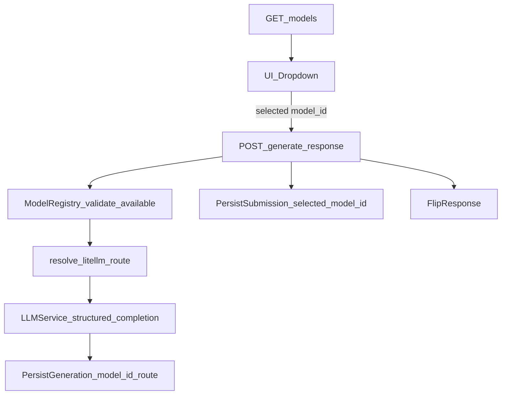

# Model selection PR (#17) — end-to-end verification plan

## Scope

- Verify **backend** exposes model catalog and accepts `submission.model_id`.
- Verify **frontend** dropdown loads models, sends selected `model_id`, and renders output.
- Verify **runtime** path works with the repo-root `.env` containing a working `OPENAI_API_KEY` (do **not** print or log the key).

## Assumptions / constraints

- Branch under test: `add-model-selection-support`
- Backend runs locally on `http://localhost:8000`
- Frontend (Next) runs locally on `http://localhost:3000`
- Frontend is configured with `NEXT_PUBLIC_API_URL=http://localhost:8000`
- Repo root contains `.env` with at least:
  - `RUN_MODE=local`
  - `OPENAI_API_KEY=...` (non-empty, valid)

## Pre-flight checks

- Confirm working tree clean and on expected branch.
- Confirm `.env` exists at repo root (do not display contents).
- Confirm backend dependency manager available (`uv`) and environment can run tests.

## Backend verification

### 1) Unit/integration tests

- Run backend tests:
  - `uv sync`
  - `PYTHONPATH=backend:. uv run pytest backend/tests`
- Expected:
  - All tests pass.

### 2) API smoke tests (local server)

- Start backend:
  - `PYTHONPATH=backend:. uv run uvicorn app.main:app --host 0.0.0.0 --port 8000`
- Verify model catalog:
  - `GET /models`
  - Expected:
    - `default_model_id` present and corresponds to an **available** model
    - `models[]` non-empty
    - Each entry has `model_id`, `display_name`, `provider`
- Verify generation accepts model:
  - `POST /generate_response` with a `submission.model_id` selected from `GET /models`
  - Expected:
    - 200 response with `flipped_text` and `explanation`
- Negative checks:
  - Unknown `model_id` returns 400
  - Unavailable `model_id` returns 400

## Frontend verification

### 1) Lint/build checks

- Run:
  - `cd flip-prototype && npm install`
  - `cd flip-prototype && npm run lint`
  - `cd flip-prototype && npm run build`
- Expected:
  - Lint passes
  - Build succeeds

### 2) UI end-to-end smoke test (local dev)

- Start frontend:
  - `cd flip-prototype && NEXT_PUBLIC_API_URL=http://localhost:8000 npm run dev -- --port 3000`
- Steps:
  - Load page and confirm the **Model** dropdown is present.
  - Wait for dropdown options to populate from `GET /models`.
  - Select a non-default model (if multiple).
  - Paste a short input post, click **Flip**.
  - Confirm output renders under **Flipped output**.
  - Confirm backend logs show the expected `model_id` matching the dropdown selection.

## Results (fill during execution)

- Pre-flight: **pass** (branch clean; local backend/frontend runnable; `.env` loaded without printing secrets)
- Backend tests: **pass** (`PYTHONPATH=backend:. uv run pytest backend/tests` → 39 passed)
- Backend API smoke: **pass**
  - `GET /models` returned populated model catalog
  - `POST /generate_response` returned 200 with `flipped_text`/`explanation` when using `model_id=openai-gpt-4o-mini`
  - Negative checks (unknown/unavailable `model_id`) covered by test suite
- Frontend lint/build: **pass** (`npm run lint`, `npm run build`)
- End-to-end UI smoke: **pass**
  - Dropdown populated with backend `/models` options
  - Selecting **OpenAI GPT-4o Mini** and clicking **Flip** produced rendered output
  - Note: if persistence is enabled against a DB that has not applied migration `0002`, generation fails with a DB error about missing `selected_model_id`. For local smoke testing without migrating DB, run backend with `PERSISTENCE_ENABLED=false`.

---

name: Model Selection End-to-End
overview: Add user-selectable model support across UI, backend validation/execution, and persistence, using your provided model registry set plus gpt-5-nano as default. Implement this with a clean model-catalog boundary, provider-safe routing, and explicit migration/test coverage.
todos:

- id: catalog-availability-config
content: Update models.yaml with default gpt-5-nano, add availability flags, and align enabled models to the provided registry list plus gpt-5-nano.
status: completed
- id: registry-selection-api
content: Extend model registry to list available models, validate model availability, and resolve public model_id to litellm route.
status: completed
- id: provider-support-anthropic-openrouter
content: Implement and register Anthropic/OpenRouter providers with structured-output compatible request preparation and env var support.
status: completed
- id: api-schema-model-carry
content: Add model_id to SubmissionContext, add model catalog response schemas, and keep backward-safe defaults.
status: completed
- id: api-endpoints-models-validate
content: Add GET /models endpoint and validate submission.model_id in POST /generate_response with clear error handling.
status: completed
- id: service-execution-persistence
content: Use selected model in generation service execution and propagate model metadata through repository calls.
status: completed
- id: db-migration-model-fields
content: Create Alembic migration and ORM updates to persist model identifiers in submissions and generations.
status: completed
- id: frontend-dropdown-wireup
content: Implement model dropdown in UI, fetch catalog from backend, default to gpt-5-nano, and send model_id in submission payload.
status: completed
- id: tests-and-regressions
content: Add/adjust backend tests for registry, API validation, service behavior, and persistence integration; verify frontend payload behavior.
status: completed
- id: docs-and-rollout-notes
content: Update README/docs with API contract, env requirements, default model, and availability semantics.
status: completed
isProject: false

---

# Model Selection Plan (UI → Backend → DB → Tooling)

## Objective

Implement model selection end-to-end so users can choose a model from a dropdown, backend validates and executes the chosen model, and persistence stores the selected model ID in both submission and generation records.

Default model: `gpt-5-nano`.

Available models (enabled):

- `gpt-5-nano`
- `openai-gpt-4o-mini`
- `claude-4.5-sonnet`
- `claude-4.5-haiku`
- `openrouter-llama-3.3-70b`
- `openrouter-qwen3-32b`

## Design Principles (Clean Code)

- Single source of truth for public model catalog in `[backend/ml_tooling/llm/config/models.yaml](backend/ml_tooling/llm/config/models.yaml)`.
- Keep UI model labels/config backend-driven (`GET /models`) to avoid hardcoded frontend drift.
- Separate concerns: public `model_id` vs provider `litellm_route` resolution.
- Prefer explicit typed schemas and narrow interfaces over ad-hoc dicts.
- Backward-safe migration path with deterministic defaults.

## Implementation Steps

### 1) Normalize model catalog and availability flags

- Update `[backend/ml_tooling/llm/config/models.yaml](backend/ml_tooling/llm/config/models.yaml)`:
  - Set `models.default.default_model` to `gpt-5-nano`.
  - Add model metadata per supported entry: `available`, `litellm_route`, optional `display_name`.
  - Keep non-target models present but `available: false`.
- Keep provider defaults (`llm_inference_kwargs`) and model-specific overrides (e.g., `gpt-5-nano` temperature).

### 2) Extend model registry API for selection workflow

- Refactor/extend `[backend/ml_tooling/llm/config/model_registry.py](backend/ml_tooling/llm/config/model_registry.py)`:
  - Add `list_available_models()` returning model metadata for UI.
  - Add `is_available(model_id)` validation helper.
  - Add `resolve_litellm_route(model_id)` to map public model IDs to provider routes.
  - Ensure `get_default_model()` returns validated available default.
- Preserve existing hierarchical kwarg resolution behavior.

### 3) Add provider support required by enabled models

- Add new providers under `[backend/ml_tooling/llm/providers/](backend/ml_tooling/llm/providers/)`:
  - `anthropic_provider.py`
  - `openrouter_provider.py`
- Register providers in `[backend/ml_tooling/llm/providers/registry.py](backend/ml_tooling/llm/providers/registry.py)`.
- Ensure structured output path works for these providers (or deterministic JSON-mode fallback compatible with current `structured_completion` parsing).
- Add env var support in `[backend/lib/load_env_vars.py](backend/lib/load_env_vars.py)`:
  - `ANTHROPIC_API_KEY`
  - `OPENROUTER_API_KEY`

### 4) Update API schemas to carry model ID throughout submission lifecycle

- Update `[backend/app/schemas.py](backend/app/schemas.py)`:
  - `SubmissionContext` includes `model_id` (default to `gpt-5-nano` for compatibility).
  - Add response schemas for model catalog endpoint (`ModelOption`, `ModelCatalogResponse`).
- Maintain validation constraints and keep schema naming explicit.

### 5) Expose model catalog endpoint and validate selected model

- In `[backend/app/api/routers/generate.py](backend/app/api/routers/generate.py)`:
  - Add `GET /models` endpoint returning available models + default.
  - In `POST /generate_response`, validate `req.submission.model_id` against registry availability.
  - Return clear 4xx errors for unknown/unavailable model IDs.

### 6) Execute selected model and persist model metadata

- In `[backend/app/services/generation_service.py](backend/app/services/generation_service.py)`:
  - Resolve `litellm_route` from selected `model_id`.
  - Pass resolved route into `structured_completion(..., model=...)`.
  - Persist submission with selected `model_id`.
  - Persist generation with model fields populated (public model ID + provider route as designed).
- Update repo interfaces/implementations as needed:
  - `[backend/app/db/repos/interfaces.py](backend/app/db/repos/interfaces.py)`
  - `[backend/app/db/repos/sqlalchemy/submission_repo.py](backend/app/db/repos/sqlalchemy/submission_repo.py)`
  - `[backend/app/db/repos/sqlalchemy/generation_repo.py](backend/app/db/repos/sqlalchemy/generation_repo.py)`
  - `[backend/app/db/repos/noop.py](backend/app/db/repos/noop.py)`

### 7) Database migration for durable model tracking

- Add Alembic revision in `[backend/alembic/versions/](backend/alembic/versions/)`:
  - `submissions.selected_model_id` (nullable initially, backfilled, then non-null if safe).
  - `generations.model_id` (or equivalent explicit field if separating from existing `model_name`).
- Update ORM models:
  - `[backend/app/db/models/submission.py](backend/app/db/models/submission.py)`
  - `[backend/app/db/models/generation.py](backend/app/db/models/generation.py)`
- Keep migration idempotent and downgrade-safe.

### 8) Frontend dropdown and request wiring

- Update `[flip-prototype/app/page.tsx](flip-prototype/app/page.tsx)`:
  - Fetch `GET /models` on load.
  - Add model dropdown with default preselected.
  - Include `submission.model_id` in flip request payload.
  - Reuse submission object for feedback calls (already done), so model context stays attached.
- Keep UX resilient: disabled state while loading catalog, fallback to default model.

### 9) Tests and regression coverage

- Update/add tests:
  - `[backend/tests/test_generate_response.py](backend/tests/test_generate_response.py)`: model validation + endpoint behavior.
  - `[backend/tests/test_generation_service.py](backend/tests/test_generation_service.py)`: selected model execution and persistence args.
  - `[backend/tests/test_persistence_integration.py](backend/tests/test_persistence_integration.py)`: DB rows include submission/generation model IDs.
  - New registry tests for `available` filtering/default/route resolution.
- Frontend checks:
  - verify dropdown rendering and payload includes selected model ID.

### 10) Documentation and operational notes

- Update backend docs in `[backend/README.md](backend/README.md)`:
  - model catalog contract (`GET /models`, request payload shape)
  - required env vars for Anthropic/OpenRouter
  - default model and availability semantics

## Data Flow (Target)

## Manual / E2E Testing Plan

Execute these steps to verify model selection works end-to-end (backend and frontend).

### Backend

1. **Unit and integration tests**
  - From `backend/`: run `uv run pytest` (optionally exclude Docker integration with `-k "not persistence_integration"` if Docker unavailable).
  - Confirm all tests pass, including `test_model_registry.py`, `test_generate_response.py` (models endpoint + validation), `test_generation_service.py`, and `test_security_controls.py`.
2. **API contract checks (backend running locally)**
  - Start backend: from `backend/`, `uv run uvicorn app.main:app --reload --host 0.0.0.0 --port 8000`.
  - `GET http://localhost:8000/models`: expect 200, JSON with `default_model_id` (e.g. `gpt-5-nano`) and `models` array of `{ model_id, display_name, provider }`; at least `gpt-5-nano` and `openai-gpt-4o-mini` present.
  - `POST http://localhost:8000/generate_response` with body `{ "text": "test", "submission": { "id": "<uuid>", "created_at": "<iso>", "input_text": "test", "model_id": "gpt-5-nano" } }`: expect 200 and `flipped_text` / `explanation` (requires valid `OPENAI_API_KEY` for real LLM), or confirm 401/503 if keys missing.
  - Same POST with `model_id: "does-not-exist"`: expect 400 and error message mentioning unknown model.
  - Same POST with `model_id: "gpt-4"` (unavailable): expect 400 and message about model not available.
3. **Health**
  - `GET http://localhost:8000/health`: expect 200 and `{"status":"ok"}`.

### Frontend

1. **Build and lint**
  - From `flip-prototype/`: run `npm run lint` and `npm run build`; fix any errors.
2. **Browser E2E (backend and frontend running)**
  - Backend running on port 8000 (see step 2). Set `NEXT_PUBLIC_API_URL=http://localhost:8000` (e.g. in `flip-prototype/.env.local`).
  - Start frontend: from `flip-prototype/`, `npm run dev`.
  - Open app in browser (e.g. [http://localhost:3000](http://localhost:3000)).
  - **Model dropdown**: page shows a "Model" dropdown; options match `GET /models` (e.g. GPT-5 Nano, OpenAI GPT-4o Mini, etc.); default selection is the backend default (e.g. gpt-5-nano).
  - **Flip flow**: enter text, click Flip; request succeeds (200) and flipped text + explanation appear; optionally verify in network tab that request body includes `submission.model_id` matching selected value.
  - **Feedback flow**: submit thumb up/down or edit feedback; requests succeed and submission context (including `model_id`) is sent.
  - **Error handling**: if backend is stopped or returns 4xx, UI shows a clear error (e.g. toast) and does not crash.

### Sign-off

- Backend tests pass.
- GET /models and POST /generate_response (valid and invalid model_id) behave as above.
- Frontend builds and lint passes.
- In browser: model dropdown populated from backend, default correct, flip and feedback work with selected model_id.
- Optional: with persistence enabled, confirm DB has `submissions.selected_model_id` and `generations.model_id` set after a flip.

## Acceptance Criteria

- UI displays only enabled models from backend endpoint and defaults to `gpt-5-nano`.
- Backend rejects unknown/unavailable model IDs with clear 4xx response.
- Selected model is used for generation execution.
- DB stores selected model ID in submission and generation records for each request.
- Tests pass for registry, API, service, and persistence behavior.
- Documentation reflects new model selection contract and required keys.

