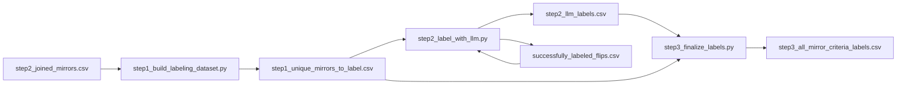

# Reward Criteria Labeling Plan

## Remember

- Exact file paths always
- Exact commands with expected output
- DRY, YAGNI, TDD, frequent commits
- UI changes: agent captures before/after screenshots itself (no README or instructions for the user)

## Overview

We will add a new experiment pipeline in `[/Users/mark/Documents/work/mirrorview-worktree/experiments/label_criteria_for_reward_model_2026_03_10/](/Users/mark/Documents/work/mirrorview-worktree/experiments/label_criteria_for_reward_model_2026_03_10/)` that labels every unique mirror with six binary Stage-1 reward-model criteria from [GitHub issue #28](https://github.com/METResearchGroup/mirrorview/issues/28) using the existing `[LLMService](/Users/mark/Documents/work/mirrorview-worktree/backend/ml_tooling/llm/llm_service.py)` and model id `gpt-5-nano`. The plan intentionally starts from the joined mirror artifact rather than the pairwise artifact, because the pairwise file repeats the same mirror text across participants, while the joined artifact yields a stable labeling unit of `post_id + mirror_id` with exactly 4,795 unique mirrors to score.

## Happy Flow

1. `[/Users/mark/Documents/work/mirrorview-worktree/experiments/train_prompt_optimization_2026_03_10/artifacts/step2_joined_mirrors.csv](/Users/mark/Documents/work/mirrorview-worktree/experiments/train_prompt_optimization_2026_03_10/artifacts/step2_joined_mirrors.csv)` is read as the source of truth because each `post_id` has one stable text for each of the five mirrors (`human`, `llama`, `qwen`, `claude`, `gpt4o`).
2. `step1_build_labeling_dataset.py` in `[/Users/mark/Documents/work/mirrorview-worktree/experiments/label_criteria_for_reward_model_2026_03_10/](/Users/mark/Documents/work/mirrorview-worktree/experiments/label_criteria_for_reward_model_2026_03_10/)` explodes each joined row into five rows, one per mirror, keyed by `label_id = post_id + mirror_id`, and writes `artifacts/step1_unique_mirrors_to_label.csv`.
3. `step2_label_with_llm.py` loads unlabeled rows from that step-1 CSV, skips any `label_id` already present in `artifacts/successfully_labeled_flips.csv`, chunks the remainder into batches, and calls `LLMService.structured_batch_completion(...)` from `[/Users/mark/Documents/work/mirrorview-worktree/backend/ml_tooling/llm/llm_service.py](/Users/mark/Documents/work/mirrorview-worktree/backend/ml_tooling/llm/llm_service.py)` with `model="gpt-5-nano"`.
4. Each LLM response is parsed into six binary criteria for the issue rubric: `political_us`, `opinion_not_news`, `complete`, `self_contained`, `target_topic`, and `clear_political_stance`. `step2_label_with_llm.py` appends successful label rows to `artifacts/step2_llm_labels.csv` and appends just the `label_id` values to `artifacts/successfully_labeled_flips.csv` after each successful write.
5. `step3_finalize_labels.py` joins the step-1 input rows to the accumulated LLM labels, derives `criteria_sum` and `passes_stage1_filter` (default rule: at least `5/6` criteria are `1`), validates one final row per `label_id`, and writes `artifacts/step3_all_mirror_criteria_labels.csv`.
6. `main.py` orchestrates the three steps with CLI flags for `--batch-size`, `--max-batches`, `--resume`, and `--model`, so the workflow can first run a smoke test at `batch_size=10` and `max_batches=1`, then rerun for the full dataset without changing code.

## Architecture Sketch

## Files To Add

- `[/Users/mark/Documents/work/mirrorview-worktree/experiments/label_criteria_for_reward_model_2026_03_10/__init__.py](/Users/mark/Documents/work/mirrorview-worktree/experiments/label_criteria_for_reward_model_2026_03_10/__init__.py)`
- `[/Users/mark/Documents/work/mirrorview-worktree/experiments/label_criteria_for_reward_model_2026_03_10/schemas.py](/Users/mark/Documents/work/mirrorview-worktree/experiments/label_criteria_for_reward_model_2026_03_10/schemas.py)`
- `[/Users/mark/Documents/work/mirrorview-worktree/experiments/label_criteria_for_reward_model_2026_03_10/prompts.py](/Users/mark/Documents/work/mirrorview-worktree/experiments/label_criteria_for_reward_model_2026_03_10/prompts.py)`
- `[/Users/mark/Documents/work/mirrorview-worktree/experiments/label_criteria_for_reward_model_2026_03_10/step1_build_labeling_dataset.py](/Users/mark/Documents/work/mirrorview-worktree/experiments/label_criteria_for_reward_model_2026_03_10/step1_build_labeling_dataset.py)`
- `[/Users/mark/Documents/work/mirrorview-worktree/experiments/label_criteria_for_reward_model_2026_03_10/step2_label_with_llm.py](/Users/mark/Documents/work/mirrorview-worktree/experiments/label_criteria_for_reward_model_2026_03_10/step2_label_with_llm.py)`
- `[/Users/mark/Documents/work/mirrorview-worktree/experiments/label_criteria_for_reward_model_2026_03_10/step3_finalize_labels.py](/Users/mark/Documents/work/mirrorview-worktree/experiments/label_criteria_for_reward_model_2026_03_10/step3_finalize_labels.py)`
- `[/Users/mark/Documents/work/mirrorview-worktree/experiments/label_criteria_for_reward_model_2026_03_10/main.py](/Users/mark/Documents/work/mirrorview-worktree/experiments/label_criteria_for_reward_model_2026_03_10/main.py)`
- `[/Users/mark/Documents/work/mirrorview-worktree/backend/tests/test_label_criteria_for_reward_model_pipeline.py](/Users/mark/Documents/work/mirrorview-worktree/backend/tests/test_label_criteria_for_reward_model_pipeline.py)`

## Artifacts To Write

- `[/Users/mark/Documents/work/mirrorview-worktree/experiments/label_criteria_for_reward_model_2026_03_10/artifacts/step1_unique_mirrors_to_label.csv](/Users/mark/Documents/work/mirrorview-worktree/experiments/label_criteria_for_reward_model_2026_03_10/artifacts/step1_unique_mirrors_to_label.csv)`
- `[/Users/mark/Documents/work/mirrorview-worktree/experiments/label_criteria_for_reward_model_2026_03_10/artifacts/step2_llm_labels.csv](/Users/mark/Documents/work/mirrorview-worktree/experiments/label_criteria_for_reward_model_2026_03_10/artifacts/step2_llm_labels.csv)`
- `[/Users/mark/Documents/work/mirrorview-worktree/experiments/label_criteria_for_reward_model_2026_03_10/artifacts/successfully_labeled_flips.csv](/Users/mark/Documents/work/mirrorview-worktree/experiments/label_criteria_for_reward_model_2026_03_10/artifacts/successfully_labeled_flips.csv)`
- `[/Users/mark/Documents/work/mirrorview-worktree/experiments/label_criteria_for_reward_model_2026_03_10/artifacts/step3_all_mirror_criteria_labels.csv](/Users/mark/Documents/work/mirrorview-worktree/experiments/label_criteria_for_reward_model_2026_03_10/artifacts/step3_all_mirror_criteria_labels.csv)`

## Implementation Steps

1. In `[/Users/mark/Documents/work/mirrorview-worktree/experiments/label_criteria_for_reward_model_2026_03_10/step1_build_labeling_dataset.py](/Users/mark/Documents/work/mirrorview-worktree/experiments/label_criteria_for_reward_model_2026_03_10/step1_build_labeling_dataset.py)`, read `[step2_joined_mirrors.csv](/Users/mark/Documents/work/mirrorview-worktree/experiments/train_prompt_optimization_2026_03_10/artifacts/step2_joined_mirrors.csv)`, dedupe to one row per `post_id`, then reshape the five mirror columns into one row per mirror with columns at minimum: `label_id`, `post_id`, `post_primary_key`, `mirror_id`, `mirror_text`, `original_text`, `sampled_stance`, and `sample_toxicity_type`.
2. Encode the dedupe contract explicitly: `label_id` should be deterministic, for example `f"{post_id}::{mirror_id}"`. During implementation, validate that `post_id + mirror_id` is unique. The current data check shows `step2_joined_mirrors.csv` has 959 unique posts, 5 mirrors each, and therefore 4,795 unique labeling rows.
3. In `[/Users/mark/Documents/work/mirrorview-worktree/experiments/label_criteria_for_reward_model_2026_03_10/schemas.py](/Users/mark/Documents/work/mirrorview-worktree/experiments/label_criteria_for_reward_model_2026_03_10/schemas.py)`, define the structured output schema used by `LLMService`, including the six binary fields plus minimal metadata that helps debugging, such as `confidence` or a short `notes` string if you decide that extra observability is worth the tokens.
4. In `[/Users/mark/Documents/work/mirrorview-worktree/experiments/label_criteria_for_reward_model_2026_03_10/prompts.py](/Users/mark/Documents/work/mirrorview-worktree/experiments/label_criteria_for_reward_model_2026_03_10/prompts.py)`, centralize the issue-28 rubric and build the prompt from the original post plus one mirror text. Keep the prompt deterministic and explicit that outputs must be binary `0/1` for the six criteria only.
5. In `[/Users/mark/Documents/work/mirrorview-worktree/experiments/label_criteria_for_reward_model_2026_03_10/step2_label_with_llm.py](/Users/mark/Documents/work/mirrorview-worktree/experiments/label_criteria_for_reward_model_2026_03_10/step2_label_with_llm.py)`, implement batch orchestration around `LLMService.structured_batch_completion(...)`. Required behavior:
  - load pending rows by subtracting `successfully_labeled_flips.csv`
  - chunk rows by `batch_size`
  - support `max_batches` for smoke tests
  - append successful label rows to `step2_llm_labels.csv`
  - append the corresponding `label_id` values to `successfully_labeled_flips.csv` only after the label rows are durably written
  - print per-batch counters such as `processed`, `succeeded`, `remaining`
6. Make `step2_label_with_llm.py` failure-tolerant at batch boundaries rather than per-run all-or-nothing. If a batch fails validation or an API call raises, surface the error, stop cleanly, and leave already-written labels intact so the next run can resume.
7. In `[/Users/mark/Documents/work/mirrorview-worktree/experiments/label_criteria_for_reward_model_2026_03_10/step3_finalize_labels.py](/Users/mark/Documents/work/mirrorview-worktree/experiments/label_criteria_for_reward_model_2026_03_10/step3_finalize_labels.py)`, join input rows to labels, verify no duplicate `label_id` values survive, derive `criteria_sum = political_us + opinion_not_news + complete + self_contained + target_topic + clear_political_stance`, and derive `passes_stage1_filter = criteria_sum >= 5`.
8. In `[/Users/mark/Documents/work/mirrorview-worktree/experiments/label_criteria_for_reward_model_2026_03_10/main.py](/Users/mark/Documents/work/mirrorview-worktree/experiments/label_criteria_for_reward_model_2026_03_10/main.py)`, add a simple CLI entrypoint that can run:
  - step 1 only
  - step 2 only
  - step 3 only
  - the full pipeline
   This avoids editing code between the smoke test and the full run.
9. Add pytest coverage in `[/Users/mark/Documents/work/mirrorview-worktree/backend/tests/test_label_criteria_for_reward_model_pipeline.py](/Users/mark/Documents/work/mirrorview-worktree/backend/tests/test_label_criteria_for_reward_model_pipeline.py)` for:
  - step-1 deduping and reshape to exactly five mirrors per post
  - deterministic `label_id` generation
  - step-2 skip/resume logic using an existing `successfully_labeled_flips.csv`
  - step-3 derived `criteria_sum` and `passes_stage1_filter`
  - prompt/schema integration with a mocked `LLMService`

## Criteria Rubric To Encode

Use the six issue-28 binary criteria exactly as the LLM judge contract:

1. `political_us`: the mirror expresses a political viewpoint and specifically concerns US politics rather than international politics.
2. `opinion_not_news`: the mirror is an opinion or stance, not a news headline, factual report, ad, or product promotion.
3. `complete`: the mirror is a complete, coherent response and not obviously truncated.
4. `self_contained`: the mirror can be understood without extra missing context.
5. `target_topic`: the mirror addresses at least one target topic: abortion, climate change, immigration, or gun control.
6. `clear_political_stance`: the mirror has a clear left or right lean, not neutral or unclear.

## Why Step 2, Not Step 4

Although the user suggested `step4_pairwise_preferences.csv` as a possible input, the cleaner source for Stage-1 criteria labeling is `[step2_joined_mirrors.csv](/Users/mark/Documents/work/mirrorview-worktree/experiments/train_prompt_optimization_2026_03_10/artifacts/step2_joined_mirrors.csv)`. `step4_pairwise_preferences.csv` contains 26,120 rows because participant choices create repeated winner/loser permutations, while `step2_joined_mirrors.csv` contains the stable underlying mirror texts. This lets us label each mirror once and later join the criteria labels into Stage 2 reward-model training without redundant LLM calls.

## Alternative Approaches

We could derive the mirror-labeling input from `[step4_pairwise_preferences.csv](/Users/mark/Documents/work/mirrorview-worktree/experiments/train_prompt_optimization_2026_03_10/artifacts/step4_pairwise_preferences.csv)` by deduping `winner_text` and `loser_text`, but that path is noisier because it starts from repeated participant-level comparisons rather than the canonical mirror table. We could also implement the whole workflow in one monolithic script, but splitting it into three explicit steps gives us inspectable artifacts, resumability, and a clean boundary between data shaping, LLM inference, and finalization.

## Manual Verification

- Create the unique labeling input: `cd /Users/mark/Documents/work/mirrorview-worktree/backend && uv run python ../experiments/label_criteria_for_reward_model_2026_03_10/main.py --step build-input`
Expected result: `../experiments/label_criteria_for_reward_model_2026_03_10/artifacts/step1_unique_mirrors_to_label.csv` is written with 4,795 rows and one unique `label_id` per `post_id + mirror_id`.
- Run the unit tests: `cd /Users/mark/Documents/work/mirrorview-worktree/backend && uv run pytest tests/test_label_criteria_for_reward_model_pipeline.py -q`
Expected result: tests pass for dedupe, batching, skip/resume, and final derived-score logic.
- Smoke-test the LLM labeling step with exactly one batch: `cd /Users/mark/Documents/work/mirrorview-worktree/backend && uv run python ../experiments/label_criteria_for_reward_model_2026_03_10/main.py --step label --batch-size 10 --max-batches 1 --model gpt-5-nano`
Expected result: exactly 10 rows are appended to `step2_llm_labels.csv`, exactly 10 ids are appended to `successfully_labeled_flips.csv`, and the process prints batch progress without schema errors.
- Verify resume behavior by rerunning the same smoke test command.
Expected result: the command skips the 10 already-labeled ids and either processes the next batch or reports that no pending rows remain within the requested `max_batches` window; it must not duplicate ids in `successfully_labeled_flips.csv`.
- Run the full labeling job: `cd /Users/mark/Documents/work/mirrorview-worktree/backend && uv run python ../experiments/label_criteria_for_reward_model_2026_03_10/main.py --step label --batch-size 10 --model gpt-5-nano`
Expected result: all pending mirrors are labeled across repeated batches until `successfully_labeled_flips.csv` reaches 4,795 unique ids.
- Finalize the labeled dataset: `cd /Users/mark/Documents/work/mirrorview-worktree/backend && uv run python ../experiments/label_criteria_for_reward_model_2026_03_10/main.py --step finalize`
Expected result: `step3_all_mirror_criteria_labels.csv` contains exactly one row per `label_id` with the six binary fields, `criteria_sum`, and `passes_stage1_filter`.
- Spot-check the final labels by opening `[/Users/mark/Documents/work/mirrorview-worktree/experiments/label_criteria_for_reward_model_2026_03_10/artifacts/step3_all_mirror_criteria_labels.csv](/Users/mark/Documents/work/mirrorview-worktree/experiments/label_criteria_for_reward_model_2026_03_10/artifacts/step3_all_mirror_criteria_labels.csv)`.
Expected result: rows include the original post, mirror text, mirror id, all six criteria, and the derived pass/fail fields needed for Stage 2 filtering.

## Plan Assets

Use `[/Users/mark/Documents/work/mirrorview-worktree/docs/plans/2026-03-10_label_criteria_for_reward_model_280028/](/Users/mark/Documents/work/mirrorview-worktree/docs/plans/2026-03-10_label_criteria_for_reward_model_280028/)` for any notes or validation artifacts associated with this work. No UI screenshots are required because this is a data and backend experiment task.