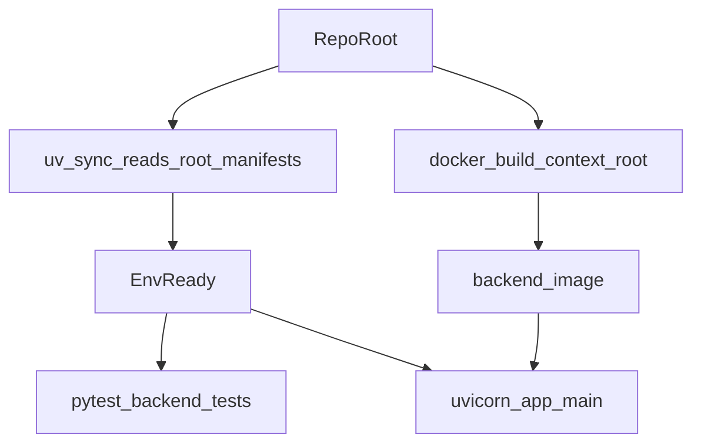

# Root `pyproject.toml` migration (backend → repo root)

## Remember

- Exact file paths always
- Exact commands with expected output
- DRY, YAGNI, TDD, frequent commits

## Overview

We will relocate Python environment management from `[backend/pyproject.toml](backend/pyproject.toml)` to a new repo-root `[pyproject.toml](pyproject.toml)` so `uv sync`/`uv run` apply to Python code across the repository (notably `[experiments/](experiments/)`), without breaking existing import conventions (`app.*`, `lib.*`, `ml_tooling.*`, and `backend.*`). We’ll update the backend Docker build (Railway) to use the root manifests and make sure **all tests under `[backend/tests/](backend/tests/)`** run cleanly.

## Plan assets

Store migration notes/artifacts in:

- `docs/plans/2026-03-11_root_pyproject_migration_631842/`

## Happy Flow

1. Developer runs from repo root: `uv sync` reads `[pyproject.toml](pyproject.toml)` + `[uv.lock](uv.lock)` and creates/updates the environment.
2. Commands that need backend-local imports run with `PYTHONPATH=backend:.` so both:
  - repo-root packages (e.g. `backend.*`, `experiments.*`) and
  - backend-root packages (e.g. `app.*`, `lib.*`, `ml_tooling.*`)
   resolve consistently.
3. Tests run from repo root: `PYTHONPATH=backend:. uv run pytest backend/tests` and `backend/tests/conftest.py` still enforces hermetic defaults.
4. Docker image builds from repo root using `[backend/Dockerfile](backend/Dockerfile)`, installs deps via root manifests, then runs Uvicorn with `PYTHONPATH` configured so `app.main:app` imports successfully.

## Alternative approaches

- **Refactor imports to a single namespace** (e.g. make everything `backend.`* and run `uvicorn backend.app.main:app`). This removes the need for `PYTHONPATH`, but is a larger, riskier refactor touching many imports and deployment entrypoints.
- **Package/install backend subpackages** so `app`/`lib`/`ml_tooling` are installable from root without `PYTHONPATH`. This is doable, but requires build-system decisions (setuptools/hatch) and is more work than needed for the migration goal.

We’re choosing the **minimal-change** option: move manifests to root + standardize root commands + set `PYTHONPATH=backend:.` in the few execution entrypoints that need it (docs, Docker, any scripts).

## Implementation todos

- **move-manifests**: Move/rename the environment manifests to repo root.
  - Move `[backend/pyproject.toml](backend/pyproject.toml)` → `[pyproject.toml](pyproject.toml)`
  - Move `[backend/uv.lock](backend/uv.lock)` → `[uv.lock](uv.lock)`
  - Move `[backend/.python-version](backend/.python-version)` → `[.python-version](.python-version)`
  - Sanity-check that `project.name`/`requires-python` remain correct for repo-root usage.
- **update-dockerfile**: Update `[backend/Dockerfile](backend/Dockerfile)` to build from repo root.
  - Copy root manifests for caching:
    - `COPY pyproject.toml ./`
    - `COPY uv.lock ./`
  - Copy only needed backend runtime sources (avoid `COPY . .` if possible), e.g.:
    - `COPY backend/ ./backend/`
  - Set runtime import path so `app.`* and `lib.*` work:
    - `ENV PYTHONPATH=/app/backend:/app`
  - Ensure the entrypoint works from repo-root context:
    - `uv run uvicorn app.main:app ...`
  - Decide on `WORKDIR` (either keep `/app` and rely on `PYTHONPATH`, or set `WORKDIR /app/backend`). Prefer `/app` + explicit `PYTHONPATH`.
- **dockerignore**: Ensure Docker build context ignores the right files.
  - Add repo-root `[.dockerignore](.dockerignore)` (Railway builds from repo root) with at least:
    - `.venv`, `**/__pycache__`, `**/*.pyc`, `.pytest_cache`, `.coverage`, `htmlcov`, `.git`, `flip-prototype/node_modules`, `**/.next`, and do **not** exclude `README.md`.
  - Keep or delete `[backend/.dockerignore](backend/.dockerignore)` depending on whether anything still builds with `backend/` as the Docker context.
- **update-docs**: Update docs to run from repo root and include the required `PYTHONPATH`.
  - Update `[docs/runbook/LOCAL_DEVELOPMENT.md](docs/runbook/LOCAL_DEVELOPMENT.md)`:
    - Setup: `uv sync`
    - Server: `PYTHONPATH=backend:. uv run uvicorn app.main:app ...`
    - Tests: `PYTHONPATH=backend:. uv run pytest backend/tests`
    - Ruff: `PYTHONPATH=backend:. uv run ruff check .`
    - Alembic: `PYTHONPATH=backend:. uv run alembic -c backend/alembic.ini upgrade head`
  - Update `[backend/README.md](backend/README.md)` similarly (and remove “From `backend/`” wording).
- **update-experiment-invocation**: Standardize how experiments are run from root.
  - Prefer module execution so relative imports are correct:
    - `PYTHONPATH=backend:. uv run python -m experiments.label_criteria_for_reward_model_2026_03_10.main --step build-input`
- **repo-cleanup**: Remove or update any remaining hard-coded `cd backend` guidance where it affects current onboarding.
  - Minimum: `docs/runbook/LOCAL_DEVELOPMENT.md`, `backend/README.md`.
  - Optional: update recent plan templates if they’re used as runbooks (not strictly required).

## Manual Verification

- **Environment sync** (repo root):
  - `uv sync --frozen`
  - Expected: exit code 0; `uv.lock` unchanged.
- **Lint** (repo root):
  - `PYTHONPATH=backend:. uv run ruff check .`
  - Expected: exit code 0.
- **Run the full backend test suite** (repo root):
  - `PYTHONPATH=backend:. uv run pytest backend/tests`
  - Expected: exit code 0; all tests pass.
  - Note: tests using `testcontainers` require Docker; if Docker is unavailable, capture that explicitly and rerun in an environment with Docker.
- **Alembic smoke** (repo root, optional if you have a DB URL):
  - `PYTHONPATH=backend:. uv run alembic -c backend/alembic.ini upgrade head`
  - Expected: completes without config/import errors.
- **Local server smoke** (repo root):
  - `RUN_MODE=local PERSISTENCE_ENABLED=false PYTHONPATH=backend:. uv run uvicorn app.main:app --reload --host 0.0.0.0 --port 8000`
  - In another terminal: `curl -f http://localhost:8000/health`
  - Expected: HTTP 200.
- **Docker build/run smoke** (repo root):
  - `docker build -f backend/Dockerfile .`
  - Expected: image builds successfully.
  - `docker run --rm -e PORT=8000 -p 8000:8000 <image_id_or_tag>`
  - In another terminal: `curl -f http://localhost:8000/health`
  - Expected: HTTP 200.

## Notes / risk checklist

- `PYTHONPATH` is the critical compatibility knob because today’s codebase relies on **both** repo-root imports (`backend.`*, `experiments.*`) and backend-root imports (`app.*`, `lib.*`, `ml_tooling.*`).
- Railway: ensure the service builds with **repo root** as the build context (Dockerfile can remain at `backend/Dockerfile`). If Railway was previously configured with Root Directory=`backend`, it must be switched to repo root for root manifests to be visible.

